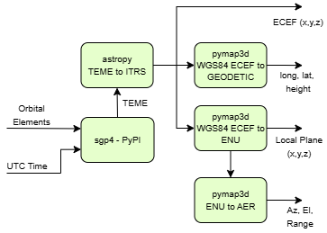

# Orbit Propagator for Tracking Earth's Artificial Satellites in LEO

Satellite orbit propagation and trajectory generation, for optical and radar tracking of space objects (Debris, Rocket Body, Payload) i.e. artificial satellites, especially for low Earth orbit (LEO) objects.

## Introduction

Using SGP4 this app searches for a period of sensor approach of a space object in Earth orbit and traces a trajectory interval in: local plane reference (ENU), AltAzRange, ITRS and Geodetic, to be used as a target for optical or radar tracking system.

## Diagrama de blocos



## Pré-requisitos  

### Windows  
1. Instale o Python (>= 3.8) através do [site oficial do Python](https://www.python.org/).  
2. Certifique-se de que o **pip** está instalado. Você pode verificar usando:  

```bash  
   pip --version  
   python -m pip install --upgrade pip  
```  

### Linux (Debian/Ubuntu)  
1. Atualize os pacotes do sistema e instale o Python caso não tenha instalado:  
```bash  
   sudo apt update && sudo apt upgrade -y  
   sudo apt install python3-pip 
```  

---

## Installation - script

1. Clone this repository:
```bash  
git clone https://github.com/francisvalguedes/TrajectoryOrbitPropag.git
cd TrajectoryOrbitPropag
```

For debian/ubuntu: clone repository then without sudo:

```bash 
./install_debian.sh
```

the install_debian.sh file will create a python environment in an env folder located in the repository folder and install the dependencies in the file requirements.txt

## Installation - manual

1. Clone this repository:

```bash  
   sudo apt install git
   git clone https://github.com/francisvalguedes/TrajectoryOrbitPropag.git  
   cd TrajectoryOrbitPropag 
``` 

2. Create and activate a virtual environment:
   
   - On Windows:

```bash  
     python -m venv env  
     env\Scripts\activate
     pip install --upgrade pip
```  

   - On Linux:

```bash  
     sudo apt install virtualenv
     virtualenv env     
     source env/bin/activate 
     pip install --upgrade pip
```  

3. Install the project dependencies:

```bash  
   pip install -r requirements.txt  
```  

## Run the streamlit application:

Activate env and run streamlit app

```bash  
cd TrajectoryOrbitPropag
streamlit run source/main.py  --server.port 8080
```  
or

```bash 
./run.sh
```

3. Open the link in shel (`http://localhost:8080`).  


### In a server: if necessary redirect port 80 to 8080

Test if the web server works on port 8080: my_ip_address:8080

to redirect the port: 
~~~
netstat -i
~~~

Redirect app port 8080 to web server port 80 according to connection name obtained above:
~~~
sudo iptables -A PREROUTING -t nat -i eth0 -p tcp --dport 80 -j REDIRECT --to-port 8080
~~~

test if web server works without specifying port, by typing in browser: my_ip_address. If it works then make the redirect permanent:
~~~
sudo apt-get install iptables-persistent
~~~

if already isntalled then restart it:
~~~
sudo dpkg-reconfigure iptables-persistent
~~~

now save iptables permenantley to files:
~~~
sudo iptables-save | sudo tee /etc/iptables/rules.v4
sudo ip6tables-save | sudo tee /etc/iptables/rules.v6
~~~

## Estrutura do Projeto  
```
.
├── source/  
│   ├── main.py  
│   ├── pages/  
|   |   └── 00_Simplified.py 
|   |   └── 01_orbital_elements.py 
|   |   └── 02_orbit_propagation.py 
|   |   └── 03_map.py 
|   |   └── 04_orbit_compare.py 
│   │   └── 05_trajectory.py  
├── lib/  
│   ├── constants.py  
│   └── orbit_functions.py 
│   └── pages_functions.py 
├── data/  
│   └── confLocalWGS84.csv 
│   └── ...celestrak.csv 
├── locales/  
│   └── map_tilelayer.json 
├── requirements.txt  
├── LICENSE
├── install_debian.sh
├── run.sh 
└── README.md 
```  

## Libraries Used

- SGP4 - MIT License
- Astropy - BSD-3-Clause
- pandas - BSD-3-Clause
- numpy - BSD-3-Clause
- streamlit - Apache 2.0
- pymap3d - BSD-2-Clause
- Geopandas - BSD 3-Clause License
- Folium - MIT License
  
## Contribution

- Contributions are welcome! Feel free to open issues and pull requests.

## License

- This project is licensed under the MIT License. See the LICENSE file for more details.

## Author

- Autor: Francisval Guedes Soares,- 
- Contributions/suggestions from: Felipe Longo, Hareton, André Henrique, Marcos Leal, Leilson, Alan Karlo.
